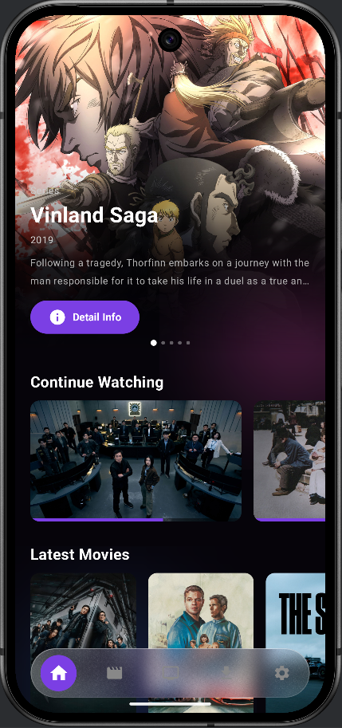

<div align="center">


# nexfin

**nexfin is the next Jellyfin client for Android** — a simple, clean, native player for streaming your own self-hosted movie & series collection.

[](https://www.android.com/)
[](https://kotlinlang.org/)
[](https://developer.android.com/jetpack/compose)
[](https://developer.android.com/media/media3)
[](LICENSE)

</div>

---

## Overview

**nexfin** is a native Android client for [Jellyfin](https://jellyfin.org), the free software media system. Point it at your own self-hosted Jellyfin server and stream your personal film and series library anywhere — no third-party accounts, no telemetry, no cloud middleman.

Built entirely from scratch with **Kotlin** and **Jetpack Compose** (single-Activity architecture), nexfin focuses on keeping things simple — a clean, dark interface that stays out of your way and lets you focus on what matters: watching your content.

> **Disclaimer:** nexfin is an independent, unofficial client and is **not affiliated with or endorsed by the Jellyfin project**.

---

## ⚠️ Early Version Notice

nexfin is a **personal side project** built in my spare time — it is not a full-time or commercial product.

This is the **earliest public release (v1.0.0)**, and as such, you should expect:

- Bugs and rough edges that haven't been ironed out yet
- Missing features that are still on the roadmap
- Occasional crashes or unexpected behavior on certain devices or server configurations
- Limited testing — primarily tested against a personal self-hosted Jellyfin server

I'm sharing this openly in the hope that it's useful to others in the self-hosted community, and I'll continue improving it as time allows. If you run into issues or have suggestions, feel free to open an Issue — all feedback is welcome.

---

## Features

### Home & Browsing
- **Hero banner** showing 5 random titles, auto-sliding every 6 seconds
- **Latest Movies** & **Latest Shows** — the 6 newest additions from your server
- **Continue Watching** — resume from your last position, with **long-press to remove** (synced back to the server)
- Dedicated **Movies** and **Shows** pages with a complete A–Z listing

### Playback
- Built-in **video player** powered by Media3 / ExoPlayer
- **Subtitle** support
- **Download** movies and episodes for offline viewing

### Experience
- **3 UI languages**: Indonesia · English · 中文
- **Adaptive layout** — Mobile (portrait) and Tablet (landscape with sidebar)
- **Dark theme** with purple accents — clean and minimal
- App icon: a neon purple glowing **"N"**

### Account
- Log in to your private Jellyfin server via **URL + username + password**

---

## Screenshots

> Replace these placeholders with real captures. Recommended: drop PNGs into `docs/screenshots/`.

| Home | Continue Watching | Player | Tablet Layout |
|:---:|:---:|:---:|:---:|
|  |  |  |  |

---

## Tech Stack

| Area | Library |
|---|---|
| Language | Kotlin |
| UI | Jetpack Compose (single Activity) |
| Networking | OkHttp (Jellyfin REST API) |
| Image loading | Coil |
| UI blur effects | [Haze](https://github.com/chrisbanes/haze) `0.7.3` |
| Video playback | Media3 / ExoPlayer |
| Offline | Local storage download management |

---

## Requirements

- **Android Studio** (recent stable) with a current Android SDK
- **JDK 17**
- A running, reachable **Jellyfin server** to log in to
- A device or emulator meeting the project's minimum SDK

---

## Build & Install

### Clone

```bash
git clone https://github.com/blightsore73/nexfin.git
cd nexfin
```

### Build from Android Studio (recommended)

1. Open the project folder in **Android Studio**.
2. Let Gradle sync finish.
3. Select a device/emulator and press **Run ▶**.

### Build from the command line

```bash
# Debug APK
./gradlew assembleDebug

# Release APK (unsigned unless you configure signing)
./gradlew assembleRelease
```

On Windows use `gradlew.bat` instead of `./gradlew`. The output APK lands in:

```
app/build/outputs/apk/debug/app-debug.apk
```

Install it manually:

```bash
adb install app/build/outputs/apk/debug/app-debug.apk
```

### First run

1. Open the app.
2. Enter your Jellyfin **server URL** (e.g. `http://192.168.1.10:8096` or your domain).
3. Enter your **username** and **password**.
4. Browse and stream.

---

## Project Info

- **Package name:** `com.jellyfin.client`

---

## Contributing

Issues and pull requests are welcome. For larger features, open an issue first so the approach can be discussed before you start.

---

## License

Distributed under the **GNU General Public License v3.0**. See [`LICENSE`](LICENSE) for the full text.

---

## Acknowledgements

- The [Jellyfin](https://jellyfin.org) project and community for the open media server.
- [Haze](https://github.com/chrisbanes/haze) by Chris Banes for blur effects.
- [Media3 / ExoPlayer](https://developer.android.com/media/media3) for playback.
